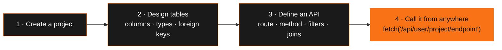
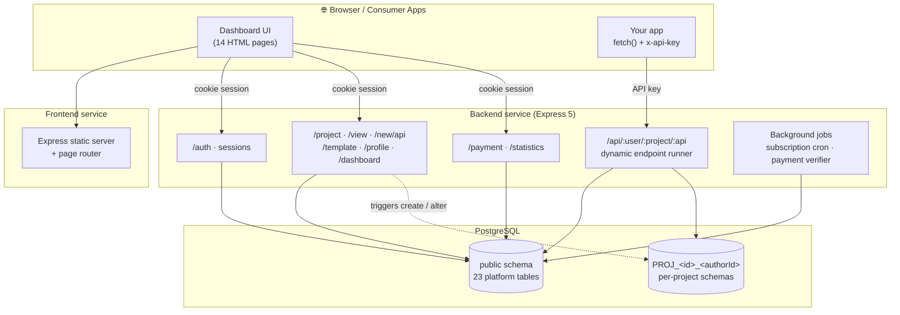
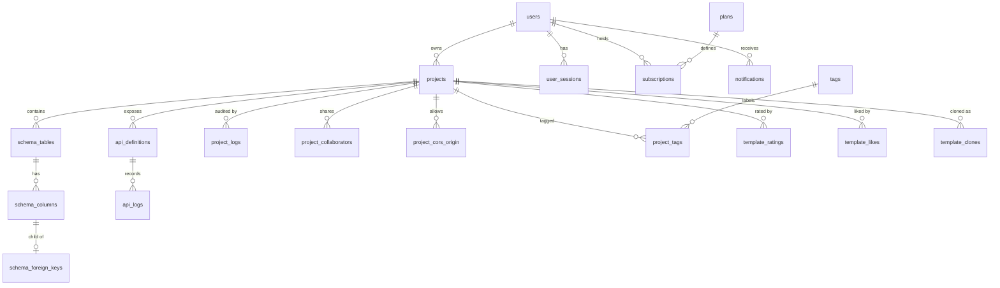

<div align="center">


**A visual Backend-as-a-Service platform.** Design your tables, wire up REST endpoints through simple forms, and call them from any frontend with `fetch()` — no servers, no boilerplate, no SQL required.


<br/>


[**Features**](#-features) ·
[**How it works**](#-how-it-works) ·
[**Getting started**](#-getting-started) ·
[**API usage**](#-calling-your-api) ·
[**Architecture**](#-architecture) ·
[**Contributors**](#-contributors)

</div>

---

## 📖 Table of Contents

- [About](#-about)
- [Features](#-features)
- [How it works](#-how-it-works)
- [Tech stack](#-tech-stack)
- [Architecture](#-architecture)
- [Getting started](#-getting-started)
- [Environment variables](#-environment-variables)
- [Calling your API](#-calling-your-api)
- [Plans & limits](#-plans--limits)
- [Database design](#-database-design)
- [Backend endpoints](#-backend-endpoints)
- [Project structure](#-project-structure)
- [Security](#-security)
- [Roadmap](#-roadmap)
- [Contributing](#-contributing)
- [License](#-license)
- [Contributors](#-contributors)

---

## ✨ About

**ApiForge** lets anyone build a working REST backend from a dashboard. You create a project, design tables with a visual builder, and define each endpoint — its route, HTTP method, joins, filters, and rate limit — through a form. ApiForge stores the definition, runs it against your project's own isolated PostgreSQL schema, and serves it at a clean URL:

```
https://<backend>/api/<username>/<project>/<endpoint>
```

Projects can be published as **templates**, so the community can browse, like, rate, and **clone** them into their own accounts in one click. Built on top of that is a full platform: collaboration, usage analytics, notifications, subscription plans, and payments.

> Built as a database-course project (**CSE 216**), ApiForge leans heavily on PostgreSQL itself — triggers, PL/pgSQL functions, JSONB, transactions, and isolation levels do a lot of the heavy lifting.

---

## 🚀 Features

<table>
<tr>
<td width="50%" valign="top">

### 🧱 Visual schema builder
- Create tables and columns without writing SQL
- Types: `INTEGER` · `TEXT` · `NUMERIC` · `BOOLEAN` · `VARCHAR` · `DATE` · `TIMESTAMP`
- Primary keys, auto-increment, unique, nullable, defaults
- Foreign keys with `CASCADE` / `SET NULL` / `RESTRICT` / `NO ACTION`
- Rename, alter, drop, and clear table data

</td>
<td width="50%" valign="top">

### 🔌 Form-driven REST APIs
- `GET` · `POST` · `PUT` · `DELETE` endpoints, defined per table
- Joins, nested `AND`/`OR` filter groups, `GROUP BY`, `HAVING`, aggregates, ordering, `LIMIT`/`OFFSET`
- Dynamic values pulled from **query params**, **request body**, or **route params**
- Per-endpoint daily rate limit and on/off switch

</td>
</tr>
<tr>
<td valign="top">

### 🔐 Auth & access control
- Session-cookie login for the dashboard (HttpOnly, hashed tokens)
- Per-project **API keys** for consumers, regenerate any time
- Per-project **allowed-origins** (CORS) allowlist
- Multi-device session manager — see and revoke sessions

</td>
<td valign="top">

### 🤝 Collaboration
- Invite other users to a project as **editors**
- Accept / reject / remove flows with live notifications
- Full **audit trail** of every change (who, what, before → after)

</td>
</tr>
<tr>
<td valign="top">

### 🧩 Template marketplace
- Publish any project as a public template
- Browse, search (by name, description, author, or tag), like, rate 1–5 with reviews, and leave feedback
- **One-click clone** into your own account
- Leaderboard: top-rated, most-cloned, most-liked, popular tags

</td>
<td valign="top">

### 📊 Analytics dashboard
- Total calls, average response time, error rate
- Calls over time with a **7-day moving average**
- Top endpoints, method distribution, error rates per endpoint
- Peak-hour heatmap data (24 buckets)
- 7-day / 30-day ranges, rendered with Chart.js

</td>
</tr>
<tr>
<td valign="top">

### 💳 Plans & billing
- Free, Lite, and Pro tiers with enforced limits
- Payment gateway integration with webhooks and payment verification
- Auto-downgrade on expiry via a background job
- Projects **lock/unlock** automatically when limits change

</td>
<td valign="top">

### 🔔 Notifications
- Collaboration invites, feedback, ratings, new-session alerts, billing events
- Mark read, mark all read, clear, dismiss
- Per-user notification preferences

</td>
</tr>
</table>

---

## 🧭 How it works



1. **Create a project.** A database trigger provisions a dedicated PostgreSQL schema for it.
2. **Design a table.** Add columns, types, and relationships from the dashboard. Triggers turn your definitions into real `CREATE TABLE` / `ALTER TABLE` statements.
3. **Create an API for it.** ApiForge does not auto-generate endpoints — you choose the route, method, and query logic in a short form.
4. **Call it.** Send the request with your project's API key. ApiForge builds a parameterized SQL query from the stored definition and runs it inside your project's schema.

---

## 🛠 Tech stack

| Layer | Technology |
| :-- | :-- |
| **Runtime** | Node.js 18+ |
| **Backend framework** | Express 5 |
| **Database** | PostgreSQL (`pg` driver) — PL/pgSQL triggers, JSONB, transactions |
| **Auth & security** | `bcrypt`, `crypto` (SHA-256), `cookie-parser`, `cors` |
| **Utilities** | `lodash`, `dotenv` |
| **Frontend** | Multi-page app — semantic HTML, custom CSS design system, vanilla JavaScript |
| **Charts** | Chart.js 4 |
| **Typography** | Space Grotesk · Inter · JetBrains Mono |
| **Payments** | MockGateway.com (init → webhook → verify) |
| **Deployment** | Two independent Node services (backend + frontend) |

---

## 🏗 Architecture

ApiForge is split into two **independent services**, each with its own `package.json` and Express server.



**Key design decisions**

- **Schema-per-project isolation.** Every project's data lives in its own schema, `PROJ_<projectId>_<authorId>`. It's created by a trigger on insert and dropped on delete.
- **Metadata-driven query engine.** Endpoint definitions are stored as JSONB. At request time, dedicated SQL builders (`select` / `insert` / `update` / `delete`) turn the definition into a **fully parameterized** query — identifiers come from the project's catalog, values are always bound parameters.
- **The database does the heavy lifting.** Schema creation, column/PK/FK changes, template cloning, audit logging, notifications, and subscription switching are implemented as PL/pgSQL triggers and functions.
- **Correctness under concurrency.** Subscription changes and statistics run in `REPEATABLE READ` transactions; plan-limit checks lock the subscription row with `FOR UPDATE`.

---

## ⚡ Getting started

### Prerequisites

- [Node.js](https://nodejs.org/) **18+**
- [PostgreSQL](https://www.postgresql.org/) **12+**
- `git`

### 1. Clone the repository

```bash
git clone https://github.com/sifat5532/ApiForge.git
cd ApiForge
```

### 2. Set up the database

```bash
createdb apiforge
psql -d apiforge -f backend/db/init.sql
```

`init.sql` creates all tables, indexes, functions, and triggers.

### 3. Run the backend

```bash
cd backend
cp .env.example .env      # then fill in your values (see table below)
npm install
node app.js
```

### 4. Run the frontend

```bash
cd ../frontend
cp .env.example .env      # set PORT and BACKEND_URL
npm install
node app.js
```

### 5. Open the app

Visit **http://localhost:3001** (or whichever `PORT` you set for the frontend), sign up, and create your first project.

### 6. Start the Payment Gateway Webhook

Visit **https://mockgateway.com/**, create a free account, get required credentials and Run the webhook with the help of the documentation of MockGateway.

<details>
<summary><b>💡 Example local configuration</b></summary>

`backend/.env`
```env
PORT=3000
NODE_ENV=development

DB_HOST=localhost
DB_PORT=5432
DB_NAME=apiforge
DB_USER=postgres
DB_PASSWORD=your_password

FRONT_END_URL=http://localhost:3001

SLUG=your_gateway_slug
AUTHORIZATION=your_gateway_key
WEBHOOK_SECRET=your_webhook_secret
```

`frontend/.env`
```env
PORT=3001
BACKEND_URL=http://localhost:3000
```

</details>

---

## 🔧 Environment variables

### Backend (`backend/.env`)

| Variable | Description |
| :-- | :-- |
| `PORT` | Port the backend listens on |
| `NODE_ENV` | `development` or `production`. In production, session cookies are `Secure` + `SameSite=None` |
| `DB_HOST` · `DB_PORT` · `DB_NAME` · `DB_USER` · `DB_PASSWORD` | PostgreSQL connection details |
| `FRONT_END_URL` | Frontend origin allowed by CORS for dashboard requests (credentials enabled) |
| `SLUG` | Payment gateway slug |
| `AUTHORIZATION` | Payment gateway bearer key |
| `WEBHOOK_SECRET` | Secret used to validate payment webhooks |

### Frontend (`frontend/.env`)

| Variable | Description |
| :-- | :-- |
| `PORT` | Port the frontend listens on (defaults to `3001`) |
| `BACKEND_URL` | Public URL of the backend (defaults to `http://localhost:3000`). Injected into the browser via `/js/config.js` |

---

## 📡 Calling your API

Once an endpoint is defined, call it from anywhere:

```
{METHOD}  https://<backend>/api/<username>/<project>/<endpoint>[/<route-param>...]
```

```js
// Example: fetch a book by id from a "bookstore" project
const res = await fetch(
  "https://your-backend.example.com/api/sifat/bookstore/get_book/42",
  { headers: { "x-api-key": "YOUR_PROJECT_API_KEY" } }
);

const books = await res.json();   // → [{ id: 42, title: "…" }]
```

**Response codes**

| Code | Meaning |
| :-: | :-- |
| `200` / `201` | Success (`201` for `POST`) |
| `400` | Missing required parameter / invalid pagination value |
| `401` | Missing or invalid API key |
| `402` | Project is **locked** (plan limit exceeded or subscription expired) |
| `403` | Browser origin is not on the project's allowlist |
| `404` | API not found or inactive |
| `405` | HTTP method doesn't match the endpoint definition |
| `429` | Daily rate limit exceeded |

<details>
<summary><b>🔍 Under the hood: what a stored endpoint definition looks like</b></summary>

You never write this by hand — the dashboard form produces it. Here's a `GET` endpoint that joins two tables and filters by a query parameter:

```jsonc
{
  "select_obj": {
    "table_id": 12,
    "table_alias": "b",
    "cols_obj_array": [
      { "table_alias": "b", "col_id": 41, "alias": "title" },
      { "table_alias": "a", "col_id": 47, "alias": "author" }
    ]
  },
  "join_obj_array": [
    {
      "type": "inner", "table_id": 13, "alias": "a", "join_operator": "=",
      "left":  { "table_alias": "b", "col_id": 44 },
      "right": { "table_alias": "a", "col_id": 46 }
    }
  ],
  "where": [
    {
      "node_type": "condition", "table_alias": "b", "col_id": 42, "operator": "=",
      "val1": {
        "is_dynamic": true,
        "dynamic_value_getting_type": "query_param",   // or "body" / "route_param"
        "dynamic_field_name": "genre",
        "is_dynamic_required": true
      }
    }
  ],
  "order_by_array": [{ "table_alias": "b", "col_id": 41, "order": "asc" }],
  "limit": 20
}
```

</details>

---

## 💎 Plans & limits

| | **Free** | **Lite** | **Pro** |
| :-- | :-: | :-: | :-: |
| Projects | 2 | 5 | ∞ |
| Tables per project | 10 | ∞ | ∞ |
| APIs per project | 30 | 150 | ∞ |
| API calls / day | 1,000 | 50,000 | ∞ |

Limits are enforced server-side. On **downgrade or expiry**, projects that exceed the new plan's limits are locked (newest first); on **upgrade**, they are unlocked again. Locked projects answer API calls with `402`.

---

## 🗄 Database design

The platform schema has **23 tables**, with per-project data living in separate schemas.



<details>
<summary><b>📋 All tables</b></summary>

| Area | Tables |
| :-- | :-- |
| **Accounts** | `users` · `user_sessions` · `notifications` |
| **Projects** | `projects` · `project_cors_origin` · `project_collaborators` · `project_logs` · `tags` · `project_tags` |
| **Schema metadata** | `schema_tables` · `schema_columns` · `schema_foreign_keys` |
| **APIs** | `api_definitions` · `api_logs` · `api_table_dependencies` · `api_column_dependencies` |
| **Templates** | `template_clones` · `template_ratings` · `template_likes` · `template_feedback` |
| **Billing** | `plans` · `subscriptions` · `subscription_log` |

</details>

**Database highlights**

- 🔁 **20+ PL/pgSQL triggers** drive schema provisioning, table/column/PK/FK DDL, template creation & cloning, notifications, and subscription switching.
- 🧾 **JSONB audit log** — `project_logs` stores `old_data` / `new_data` for every change to projects, tables, columns, foreign keys, collaborators, CORS origins, and APIs.
- 🛡 **Rich constraints** — regex `CHECK`s on usernames, emails, and identifiers; cross-column checks for clone/template/API-key rules; deferrable foreign keys for API dependencies.
- 🧮 **Analytics in SQL** — CTEs, window functions (moving average), `FILTER` aggregates, `LATERAL` joins, and `json_agg` / `json_build_object` for nested responses.
- 🔒 **Transactions with intent** — `REPEATABLE READ` for plan enforcement and statistics; `FOR UPDATE` row locks for plan-limit checks; actor tracking via `set_config('app.current_user_id', …)`.

---

## 🧷 Backend endpoints

These power the dashboard and require a valid session cookie (except register/login/webhook). The dynamic consumer endpoint is documented [above](#-calling-your-api).

<details>
<summary><b>🔑 Auth · <code>/auth</code></b></summary>

| Method | Path | Purpose |
| :-: | :-- | :-- |
| `POST` | `/auth/register` | Create an account |
| `POST` | `/auth/login` | Log in with username or email |
| `GET` | `/auth/me` | Current user |
| `POST` | `/auth/logout` | Revoke the current session |

</details>

<details>
<summary><b>📁 Projects · <code>/project</code></b></summary>

| Method | Path | Purpose |
| :-: | :-- | :-- |
| `POST` | `/project/createProject` | Create a project (returns API key once) |
| `PUT` | `/project/updateProject/:projectId` | Update a project |
| `DELETE` | `/project/deleteProject/:projectId` | Delete a project |
| `POST` | `/project/regenerateKey` | Rotate the API key |
| `POST` | `/project/createTable` · `addColumn` | Build the schema |
| `PUT` | `/project/renameTable` · `updateColumn` · `updateForeignKey` | Modify the schema |
| `DELETE` | `/project/deleteTable` · `deleteColumn` | Remove schema objects |
| `POST` | `/project/clearTableData` | Truncate a table |
| `POST` | `/project/addForeignKey` · `removeForeignKey` | Manage relationships |
| `POST` | `/project/addCorsOrigin` · `removeCorsOrigin` | Manage the origin allowlist |
| `POST` | `/project/collabInvitation` · `proceedCollabInvitation` · `removeCollaboration` | Collaboration |
| `POST` | `/project/createTemplate` · `cloneTemplate` | Template publishing & cloning |
| `POST` | `/project/deleteApi` | Delete an API definition |

</details>

<details>
<summary><b>⚙️ API definitions · <code>/new/api</code></b></summary>

| Method | Path | Purpose |
| :-: | :-- | :-- |
| `POST` | `/new/api/create` | Define a new endpoint |
| `PUT` | `/new/api/update` | Edit an endpoint |

</details>

<details>
<summary><b>👀 Views & discovery · <code>/view</code></b></summary>

Project, table, structure, data, foreign-key, CORS, collaborator, and log views; API listings; template details, feedback, search, and listings (`allTemplates`, `searchTemplate`, `likedTemplates`, `ownTemplates`, `highratedTemplates`, `mostClonedTemplates`, `mostLikedTemplates`, `popularTags`); tag search; notifications (list / mark-read / mark-all-read / clear-read / dismiss); and billing overview, plans, and history.

</details>

<details>
<summary><b>⭐ Templates, 👤 Profile, 📊 Dashboard, 💳 Payment, 📈 Statistics</b></summary>

| Method | Path | Purpose |
| :-: | :-- | :-- |
| `POST` | `/template/like` · `rate` · `feedback` | Community interactions |
| `PATCH` | `/profile/updateProfile` · `changePassword` | Account management |
| `GET` / `POST` / `DELETE` | `/profile/viewUserSessions` · `logoutothersSessions` · `removeSessions/:id` | Session manager |
| `GET` / `PATCH` | `/profile/settings` · `/profile/settings/:key` | Notification preferences |
| `GET` | `/dashboard/stats` · `recentProjects` · `recentActivity` | Dashboard summary |
| `POST` | `/payment/subscribe` | Start a plan change / payment |
| `POST` | `/payment/webhook` | Payment gateway callback |
| `GET` | `/payment/verify` · `anyPendingPayment` | Payment verification |
| `GET` | `/statistics/project/:projectId?range=7d\|30d` | Project analytics |

</details>

---

## 📂 Project structure

```
ApiForge/
├── backend/
│   ├── app.js                    # Express app entry point
│   ├── db/
│   │   ├── init.sql              # Tables, functions, triggers
│   │   ├── connection.js         # pg connection pool
│   │   ├── query.js              # Query helper with error wrapping
│   │   └── withActor.js          # Transaction helper that records the acting user
│   ├── middleware/
│   │   └── errorHandler.js
│   ├── routes/
│   │   ├── auth.js               # Register · login · sessions
│   │   ├── project.js            # Projects, schema builder, collaboration, templates
│   │   ├── api.js                # API-definition create / update
│   │   ├── serve.api.js          # Dynamic public endpoint runner
│   │   ├── view.js               # Read-only views & discovery
│   │   ├── template.js           # Like · rate · feedback
│   │   ├── profile.js            # Account & session management
│   │   ├── dashboard.js
│   │   ├── statistics.js         # Analytics queries
│   │   └── payment.js            # Subscriptions & gateway webhooks
│   └── utils/
│       ├── build.sql.*.js        # SELECT / INSERT / UPDATE / DELETE builders
│       ├── planLimitChecker.js
│       ├── subscriptionEnforcer.js
│       ├── subscriptionCron.js
│       ├── verifyPendingPayments.js
│       └── projectCatalog.js
│
└── frontend/
    ├── app.js                    # Static server + runtime config
    ├── routes/pages.router.js    # Page routing
    └── public/
        ├── pages/                # 14 HTML pages
        └── resources/
            ├── css/              # style.css · responsive.css
            └── js/               # One script per page + shared utilities
```

---

## 🔒 Security

- **Passwords** are hashed with `bcrypt`.
- **Session tokens** are 32 random bytes; only their **SHA-256 hash** is stored. Cookies are `HttpOnly`, and `Secure` + `SameSite=None` in production. Sessions expire after 10 days and can be revoked per device.
- **API keys** are 32 random bytes, shown once, stored only as a SHA-256 hash, and verified with a **timing-safe comparison**.
- **SQL injection protection** — all values are bound parameters; identifiers are quoted and resolved from the project's catalog rather than taken from requests.
- **Per-project CORS allowlists** with explicit `403` for disallowed browser origins.
- **Input constraints** enforced in the database itself (identifier patterns, type/length checks, plan-limit checks).

> Found a vulnerability? Please open a private security advisory on GitHub instead of a public issue.

---

## 🗺 Roadmap

- [x] Visual schema builder with foreign keys
- [x] Form-driven REST endpoints with joins, filters, and aggregates
- [x] Template marketplace — clone, like, rate, feedback
- [x] Collaboration & audit trail
- [x] Analytics dashboard
- [x] Subscription plans & payments

---

## 🤝 Contributing

Contributions, issues, and feature requests are welcome!

1. **Fork** the repository
2. **Create** a feature branch — `git checkout -b feature/amazing-feature`
3. **Commit** your changes — `git commit -m "Add amazing feature"`
4. **Push** to the branch — `git push origin feature/amazing-feature`
5. **Open** a Pull Request

Please open an [issue](https://github.com/sifat5532/ApiForge/issues) first for major changes so we can discuss the approach.

---

## 📄 License

Distributed under the **ISC License**.

---

## 👥 Contributors

<div align="center">

<table>
  <tr>
    <td align="center" width="220">
      <a href="https://github.com/sifat5532">
        <br/>
        <sub><b>Sifat Al Islam</b></sub>
      </a><br/>
      <sub>@sifat5532</sub>
    </td>
    <td align="center" width="220">
      <a href="https://github.com/ZTIshra19">
        <br/>
        <sub><b>Zarrin Tasnim Ishra</b></sub>
      </a><br/>
      <sub>@ZTIshra19</sub>
    </td>
  </tr>
</table>

<br/>

**If you find ApiForge useful, consider giving it a ⭐ — it means a lot!**

<br/>


</div>
